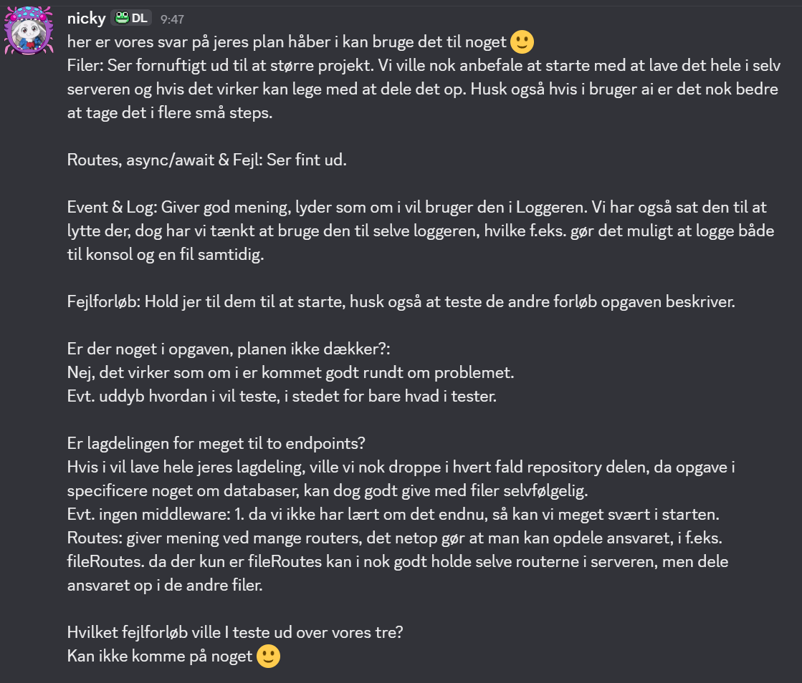
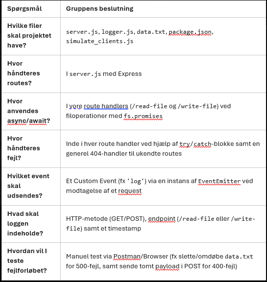

# Node ninja

## Hvad laver programmet?

En Express server, der læser og skriver en tekstfil asynkront, logger alle HTTP requests med en EventEmitter og returnerer forståelige fejl.

## Kom i gang

```bash
npm install
npm start
```

Serveren kører på `http://localhost:3000`. `npm run check` kører tests og ESLint.

## Planlægning før vi koder

Udkast som gruppen retter til. Skal vises til en anden studiegruppe, før vi koder.

| Spørgsmål | Gruppens beslutning |
|---|---|
| Hvilke filer skal projektet have? | `src/server.js`, `src/app.js`, `src/controllers/fileController.js`, `src/services/fileService.js`, `src/repositories/fileRepository.js`, `src/events/requestEmitter.js`, `src/events/requestLogger.js`, `src/middleware/` (requestEvents, notFound, errorHandler), `data/data.txt`, `scripts/simulate_clients.js`, `tests/`, `README.md` |
| Hvor håndteres routes? | `app.js` kobler URL og metode til controlleren (`app.get` og `app.post`). `notFound.js` giver 404 til alt andet. |
| Hvor anvendes async/await? | `fileRepository.js` (`fs.promises`), `fileService.js`, `fileController.js` og i `simulate_clients.js` |
| Hvor håndteres fejl? | try/catch i `fileController.js` (500 ved filfejl, 400 ved ugyldigt input). `errorHandler.js` fanger resten, fx ugyldig JSON. |
| Hvilket event skal udsendes? | `request` med `{ method, path }`, udsendt af `requestEvents.js` før alle routes, så også 404 logges. Listeneren ligger i `requestLogger.js` og kobles på emitteren i `server.js` |
| Hvad skal loggen indeholde? | Metode og path, fx `GET /read-file`. Timestamp er en udvidelse. |
| Hvordan vil I teste fejlforløbet? | Manuelt med curl eller Postman: omdøbe `data/data.txt` og kalde `/read-file` (forventer 500), POST uden `content` (400), `content` som tal (400), ugyldig JSON (400) og ukendt route (404). Automatisk med `node --test` og et fake repository. 10 requests med `scripts/simulate_clients.js`. Vi tester også de øvrige forløb fra opgaven: en gyldig POST opdaterer filen, og hver request udløser et log event. |

Vist til gruppe: Niklas og Jannicks gruppe

Dato: Vist 2. oktober 2026, svar modtaget 5. oktober 2026 kl. 09:47

Deres feedback: De syntes, planen så fornuftig ud, og anbefalede at tage AI i små trin. De foreslog at bruge eventet i selve loggeren, så man kan logge til både konsol og fil samtidig. De bad os uddybe, hvordan vi tester, og huske de øvrige forløb i opgaven. De ville droppe repository, og evt. middleware og routes, fordi det ikke er lært endnu, og fordi der kun er to endpoints.



Hvad vi ændrede efter feedback: Vi uddybede testplanen med, hvordan vi tester, og tilføjede flere fejlforløb. Vi tilføjer log til fil som udvidelse. Vi droppede routes mappen og kobler de to routes direkte i app.js, fordi der kun er to endpoints, og Router ikke er lært endnu. Vi beholdt de øvrige lag og repository, fordi vores issues er delt efter filer, og for at holde fs adskilt fra resten. Vi forklarer middleware for hinanden, før vi koder.

### Vi gav feedback til en anden gruppe

Vist til os af: Tobys gruppe

Dato: 6. oktober 2026

Tobys plan: server.js, logger.js, data.txt, package.json og simulate_clients.js. Alt i server.js med Express, async/await i route handlers med fs.promises, try/catch i hver route handler og en generel 404 handler. Et custom event (fx log) via EventEmitter og manuel test med Postman eller browser.

Vores feedback: Jeres plan dækker de centrale valg og er konkret omkring async/await, try/catch, 404 og logningens indhold. Godt at I tester både 500 og 400. To forslag: 1. Overvej at dele koden op i flere filer i stedet for alt i server.js, så den er nemmere at teste og vedligeholde. Vi delte vores i controller, service og repository. 2. Tilføj en generel fejlhandler, fordi try/catch i routes ikke fanger fejl fra express.json(), fx ødelagt JSON. Vi har en errorHandler middleware til det.



## Endpoints

| Metode | Endpoint | Funktion |
|---|---|---|
| GET | `/read-file` | Læser fil |
| POST | `/write-file` | Skriver til fil |

## Asynkronitet

Skrives af: Gon

Hvad sker der i Node.js, mens serveren venter på en filoperation? (Skrives med egne ord.)

Node.js har kun én tråd, men den står ikke og venter på filoperationer. Når handleReadFile kalder await fileService.readContent() så sendes læsningen videre til operativsystemet, og Node kan i mellemtiden tage imod andre requests. Når filen er læst, fortsætter koden efter await og svaret sendes. Med readFileSync ville serveren i stedet stå stille, indtil filen var læst, hvilket ikke er godt.

## EventEmitter

Skrives af: Mat

Hvilket event bruger vi, og hvornår bliver det udsendt? (Skrives med egne ord.)
Vi bruger et request-event, som bliver udsendt af requestEmitter.js før alle routes. Eventet indeholder method og path, som { method: 'GET', path: '/read-file' }. Dette bliver også udsendt ved 404, så alle requests bliver logget.

## Test

Skrives af: Mat (resultater fra Nickis curl tests)

1. Hvordan vi testede succes:
Vi hentet filen med curl og fik 200 OK. Vi skrev til filen med curl og fik 200 OK. Vi tjekkede at filen blev opdateret. Vi tjekkede at loggen blev skrevet til konsol og fil. 
2. Hvordan vi fremkaldte en fejl:
Vi omdøbte data.txt og hentede filen med curl, hvilket gav 500. Vi sendte POST uden content, hvilket gav 400. Vi sendte POST med content som tal, hvilket gav 400. Vi sendte POST med ugyldig JSON, hvilket gav 400. Vi hentede en ukendt route, hvilket gav 404.
3. Hvordan vi testede flere requests:
Vi kørte scripts/simulate_clients.js, som sender 10 requests til serveren. Vi tjekkede at alle requests blev logget til konsol og fil.

## AI-brug

Hver af os skriver ét konkret eksempel fra vores egne issues.

### Eksempel 1: Gon (issue 2 og 4)

1. Hvad bad vi agenten om?

   Jeg brugte agenten til at planlægge issue 2 og issue 4. Her har jeg kopieret mit issue fra GitHub, og agenten lavede en plan for, hvordan vi kunne løse opgaven.

2. Hvad foreslog eller ændrede agenten?

   Agenten foreslog en ændring i errorHandler, fordi vores eslint.config.js kun tillader 3 parametre, mens Express kræver 4 for at genkende en fejlhandler. Uden 4 parametre ville Express ikke se den som fejlhandler og ville sende et stackTrace ud i konsollen i stedet for vores egne fejlbeskeder. Derfor satte agenten function.length til 4 på errorHandler, så Express genkender den som en fejlhandler og ikke sender stackTrace ud.

3. Hvad kontrollerede vi?

   Vi kontrollerede, at agentens forslag var korrekt, og at det ville løse problemet med blandt andet eslint og Express. Vi testede både issue 2 og 4 med npm run check for at sikre os, at alle testene var grønne. Vi kontrollerede også agenten ved brug af vores Copilot instructions.

4. Accepterede, ændrede eller afviste vi forslaget?

   Vi accepterede forslaget om at bruge Object.defineProperty og implementerede det i vores errorHandler. Ellers afviste vi ingen forslag i issue 2 og 4, da vores plan var konkret, og vi satte strenge regler, så agenten ikke gik uden for vores ramme.

### Eksempel 2: Mat (issue 3 og 5)

1. Hvad bad vi agenten om?
    Jeg bad agenten om at lave en plan for issue 3 og 5, hvor vi skulle implementere request eventet og loggeren. Jeg gav agenten vores skabelon med opgave, kontekst, krav og hvad der ikke måtte ændres. Jeg skrev også, at den ikke måtte røre src/, hvis npm run check fejlede.
2. Hvad foreslog eller ændrede agenten?
    Agenten foreslog en plan for hvordan vi kunne implementere request eventet og loggeren. Den foreslog at vi skulle oprette en requestEmitter.js fil, hvor vi kunne udsende request eventet med method og path. Den foreslog også at vi skulle oprette en requestLogger.js fil, hvor vi kunne lytte på request eventet og logge method og path til konsollen.
3. Hvad kontrollerede vi?
    Vi kontrollerede at agentens forslag var korrekt, og at det ville løse problemet med at logge alle requests. Vi testede både issue 3 og 5 med npm run check for at sikre os at alle testene var grønne. Vi kontrollerede også agenten ved brug af vores co-pilot instructions.
4. Accepterede, ændrede eller afviste vi forslaget?
    Vi accepterede forslaget om at oprette requestEmitter.js og requestLogger.js filerne, og implementerede det i vores kode. Vi ændrede dog planen lidt, da vi ville logge til både konsol og fil samtidig, som den anden gruppe foreslog. Ellers fik vi ikke afviste nogle forslag i issue 3 og 5 da vores plan var konkret og vi satte strenge regler, så agenten ikke gik uden for vores ramme.

### Eksempel 3: Nicki (issue 1 og 6)

1. Hvad bad vi agenten om?
   Jeg brugte Copilot i Plan mode og gav den issuet med vores skabelon: opgave, kontekst, krav og hvad der ikke må ændres. Jeg skrev også, at den ikke måtte røre src/, hvis npm run check fejlede.

2. Hvad foreslog eller ændrede agenten?
   Planen var fem tests i tests/api.test.js: GET med indhold, GET med fejl, POST uden content, ukendt route og request eventet. Planen sagde kun, at testen kunne lytte på det udsendte event, men nævnte ikke eventets navn og indhold. Det tilføjede jeg i Update Plan: request med method og path.

3. Hvad kontrollerede vi?
   Jeg læste planen og git diff. Eventet hedder request og indeholder method og path. I diffen manglede // Arrange, // Act og // Assert i alle testene, og navnene fulgte ikke method_scenario_expectedResult. På wiring fandt jeg i diffen, at agenten satte express.json() før createRequestEvents, så ugyldig JSON ikke blev logget. Jeg rettede, så createRequestEvents står først.

4. Accepterede, ændrede eller afviste vi forslaget?
   Jeg ændrede det. Jeg rettede planen i Update Plan, og agenten rettede testene, så de har AAA og de rigtige navne. 400 testen tjekker nu også fejlbeskeden. npm run check fejlede, fordi issue 3 og 4 ikke var merget, og agenten stoppede og rørte ikke src/.

## Afslutning

Den vigtigste forskel mellem den måde, vi håndterede samtidighed på i vores Java-server, og den måde Node.js-serveren arbejder på, er at Java-serveren gav hver klient sin egen tråd fra en ExecutorService, og tråden stod og ventede på sin klient. Node bruger kun én hovedtråd, som aldrig står og venter: når en request starter en filoperation med await, går Node videre til næste request og vender tilbage, når filen er klar.